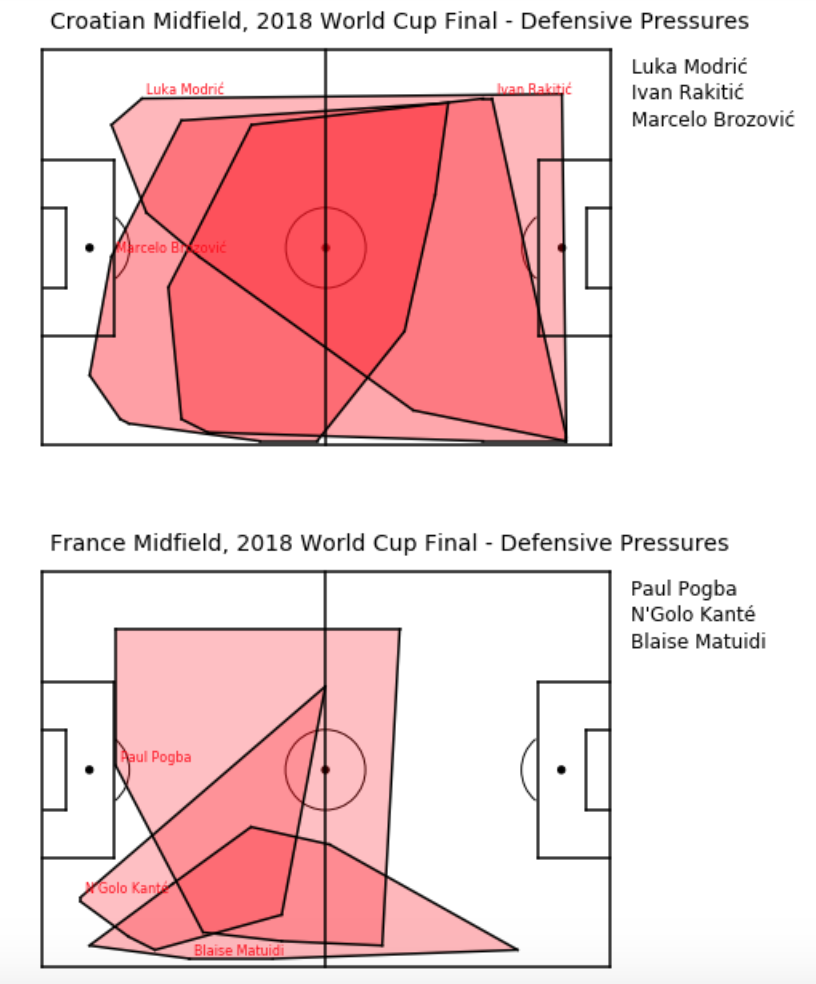

# SoccerStatistics
A repository for personal projects creating data-driven visuals for soccer players, matches, and games.

## Highlights 

### Pass Maps

Pass Maps are fun visuals that display passes from a match onto a graphic representation of a soccer field. Pass maps can be used to analyze how active a player was in possession, the types of passes he tends to make, his completion rate, and more. 

Here's one of Paul Pogba, a French midfielder, during their World Cup win over Croatia in the 2018 World Cup Final. 

### Convex Hulls
Convex Hulls- somewhat popular within the amateur data visuals community, convex hulls allow you to see the area a player spans with a specific action. Defensive pressures, when a defender comes nearby and "puts pressure" on an attacker, is an example of this kind of action. Here's a comparison of the World Cup Final midfields, and where they had defensive pressures

## Navigation

Within the folder Pass Map Generators, there contains various generators for different types of pass maps (currently there is only one type), as well as a 'Trial' notebook that shows my process of creating the generator. 

Within the folder Python Futbol, there are trials and basic tests for various different visuals - bar charts, scatter plots done with the help of FC Python tutorials tht can be found at https://fcpython.com/

